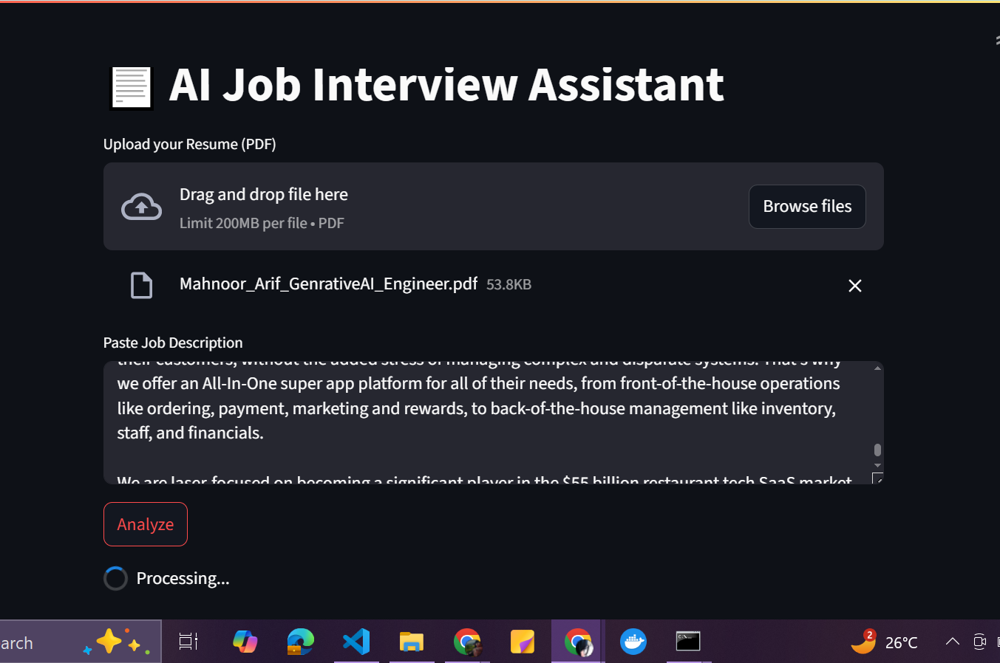
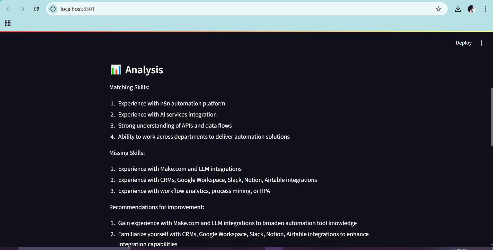
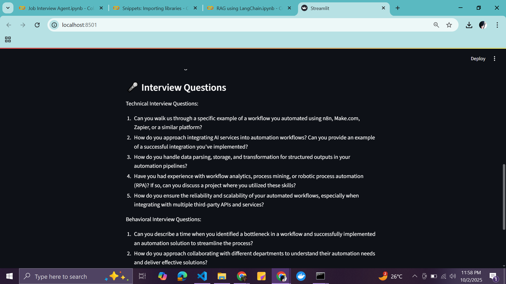
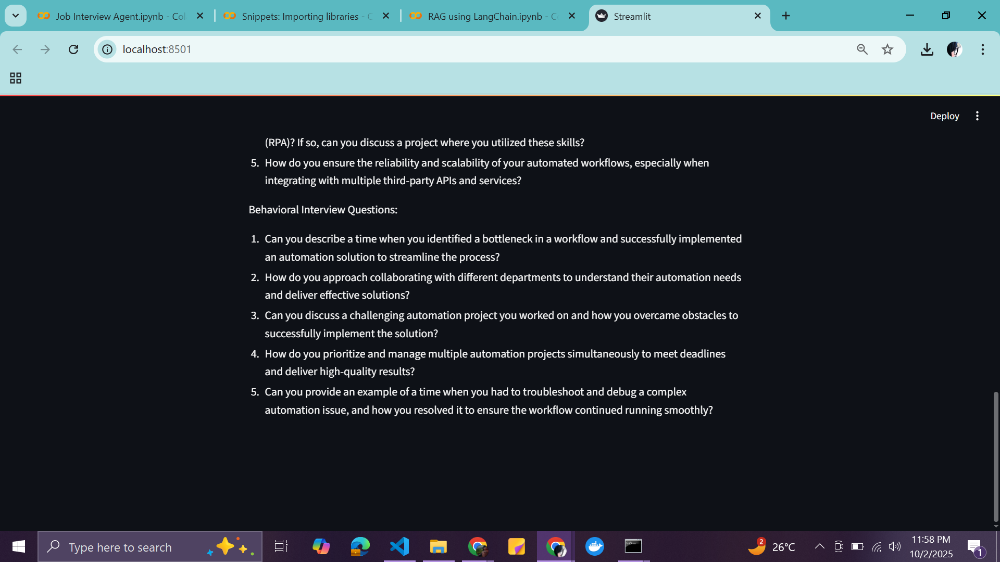

# 🤖 AI Job Interview Assistant (LangChain + Streamlit)

This project is an **AI-powered Job Interview Assistant** that compares your **resume** against a **job description**.  
It provides a **skills match, gap analysis, recommendations, and generates interview questions** to help you prepare more effectively.

Built with:
- [LangChain](https://www.langchain.com/) 🦜  
- [Streamlit](https://streamlit.io/) 📊  
- [OpenAI](https://openai.com/) LLMs  
- [ChromaDB](https://www.trychroma.com/) 🗄️  

---

## 🚀 Features
- 📂 Upload your **Resume (PDF)**
- ✍️ Paste any **Job Description**
- 📊 Get:
  - ✅ Matching Skills
  - ❌ Missing Skills
  - 💡 Recommendations for Improvement
- 🎤 Auto-generated **Technical & Behavioral Interview Questions**
- 🖥️ Interactive Streamlit UI

---

## 📊 Pipeline / Architecture

```
flowchart TD
    A[User Upload Resume (PDF)] --> B[LangChain PDF Loader]
    A2[User Paste JD (Text)] --> C[Convert to LangChain Document]
    B --> D[Embeddings (OpenAI)]
    C --> D
    D --> E[Chroma VectorDB]
    E --> F[LangChain LLM (GPT-3.5/4)]
    F --> G[Analysis & Interview Qs]
    G --> H[Streamlit UI Display]
```

---

## 🖥️ UI Workflow

### 1. Upload Resume & Paste JD


### 2. Skills & Recommendations


### 3. Interview Questions



---

## ⚙️ Installation

Clone the repo:

```bash
git clone https://github.com/yourusername/job-interview-assistant.git
cd job-interview-assistant
```

Install dependencies:

```bash
pip install -r requirements.txt
```

---

## 🔑 Setup API Key

1. Create a `.env` file in the project root:

```env
OPENAI_API_KEY=sk-your-openai-key
```

---

## ▶️ Run the App

```bash
streamlit run app.py
```

Then open 👉 [http://localhost:8501](http://localhost:8501) in your browser.

---

## 🛠️ Tech Stack
- **LangChain** → Document loading, embeddings, chains  
- **OpenAI** → LLMs for analysis & question generation  
- **ChromaDB** → Vector database for embeddings  
- **Streamlit** → UI & workflow  
- **ReportLab** → (optional) PDF export  

---

## 📌 Future Improvements
- 📝 Add **answer evaluation** (type your answers, AI gives feedback)  
- 📂 Support multiple job descriptions at once  
- 🎙️ Voice-based interaction (speech-to-text + TTS)  

